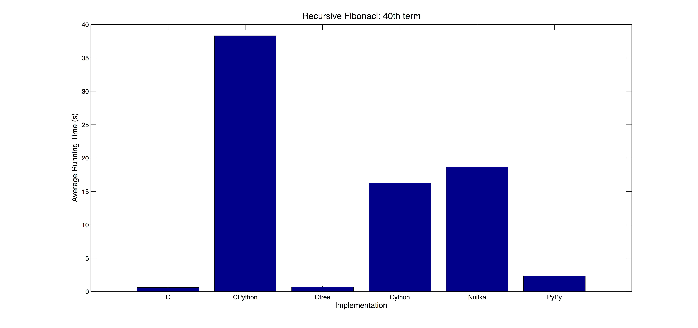

============================
Introduction to Specializers
============================

Introduction
------------
This is an introduction to the creation of specializers using ctree. You will
see how the basic structure of a specializer looks like and will be able to
create you own basic specializers.

Basic Concepts
..............

- **AST** Abstract Syntax Tree. A tree representation of a source code. This is
  the way specializers modify and convert codes.
- **JIT** Just in Time. Refers to the "just in time" compilation of the code.
  A specializer JIT compiles (compiles just in time) part of the python code
  specialized.
- **Transformer** Same as Visitor with the difference that Transformers can
  modify the tree they are traversing.
- **Visitor** A class that traverses a tree and executes actions based on the
  values of specific types of node, but without modifying them.

Creating a Simple Specializer
-----------------------------
To start creating your specializer make sure you have ``ctree`` installed::

    sudo pip install ctree

A specializer has two main classes, one inherited from the
``LazySpecializedFunction`` and the other inherited from the
``ConcreteSpecializedFunction``.

The ``LazySpecializedFunction`` will wait until the last moment before
specializing the function. You may wonder why to do that, it turns out that,
for a specializer, the last moment can be the best moment. Since you're
specializing in the last moment, your specialized function may be
created for a specific parameter type and also tuned for a specific data
structure size.

The ``ConcreteSpecializedFunction`` is the already specialized and compiled
function.

Let's create a really simple specializer. The complete code for this
specializer can be found at `<examples/fibonacci_specializer.py>`_. We will
start by implementing the fibonacci function in python.

.. code:: python

    def fib(n):
        if n < 2:
            return n
        else:
            return fib(n - 1) + fib(n - 2)

That's the function we will specialize. To do it, we will write the two
required specializer classes. The first, inherited from
``LazySpecializedFunction`` can be seen below.

.. code:: python

    import ctypes
    from ctree.types import get_ctype
    from ctree.nodes import Project
    from ctree.c.nodes import FunctionDecl, CFile
    from ctree.transformations import PyBasicConversions
    from ctree.jit import LazySpecializedFunction

    class BasicTranslator(LazySpecializedFunction):

        def args_to_subconfig(self, args):
            return {'arg_type': type(get_ctype(args[0]))}

        def transform(self, tree, program_config):
            tree = PyBasicConversions().visit(tree)

            fib_fn = tree.find(FunctionDecl, name="apply")
            arg_type = program_config.args_subconfig['arg_type']
            fib_fn.return_type = arg_type()
            fib_fn.params[0].type = arg_type()
            c_translator = CFile("generated", [tree])

            return [c_translator]

        def finalize(self, transform_result, program_config):
            proj = Project(transform_result)

            arg_config, tuner_config = program_config
            arg_type = arg_config['arg_type']
            entry_type = ctypes.CFUNCTYPE(arg_type, arg_type)

            return BasicFunction("apply", proj, entry_type)

Observe the ``BasicTranslator`` is inherited from ``LazySpecializedFunction``
class. To use the ``LazySpecializedFunction`` we import it from ``ctree.jit``.
We are overriding three methods:

.. _`args_to_subconfig`:

- **args_to_subconfig** This method receives the arguments that are being
  passed to the function we are specializing (``fib``). What is returned from
  this method will be placed on the ``program_config`` parameter passed to the
  transform_ method. This is very important as the ``program_config`` is what
  determines if a new specialized function must be created or if an already
  existing one can be used.

  Observe we return a dictionary that contains the type of the first argument
  passed to the function. When we call the ``fib`` function from python using
  an integer argument, the returned dictionary will contain the type integer.
  If we call the function again with another integer it knows it was already
  specialized for the integer type and will use the cached version. In the
  other hand, if we call ``fib`` with a different type, this will be detected
  and a new specialized function for this type will be created. Also observe
  that, to get the type, we used two functions: ``type`` and ``get_ctype``.
  ``type`` is a built-in python function to get the type. ``get_ctype`` can be
  found on ``ctree.types`` and returns the closest C type instance
  corresponding to the object. You need to use both functions.

.. _transform:

- **transform** Here is where the function transformations happen. This method
  has two parameters: ``tree`` and ``program_config``. ``tree`` is the function
  we are specializing converted to AST. ``program_config`` is a ``namedtuple``
  with two fields:

  - ``args_subconfig`` the dictionary returned by the `args_to_subconfig`_
    method;
  - ``tuner_subconfig`` contains tuning specific configurations. We are not
    using tuner here.

  For this very simple specializer we are using only a single transformer, the
  ``PyBasicConversions`` transformer. This transformer converts python code
  with obvious C analogues to C, you can import it from
  ``ctree.transformations``. It's important to notice the way the transformer
  is used. We instantiate the transformer class and then call the visit method
  passing the AST. This is the way most transformers are used. Since we only
  have a simple python code with obvious C analogues, this transformation is
  enough to transform the entire function to C.

  Next step is to convert the function return and parameters to C. The function
  we are specializing (``fib``) has its name automatically changed to ``apply``
  when being converted to AST. We can easily find the function we're
  specializing by looking for the ``apply`` function in the AST. We do this
  with the ``find`` method. In the line
  ``tree.find(FunctionDecl, name="apply")`` we're looking for a node with type
  ``FunctionDecl`` that has an attribute ``name`` with the string ``"apply"``,
  which is our function. We know the parameter type already as we got it in the
  `args_to_subconfig`_ method. For this function, the type of the parameter
  will be the same as the return. This is what we do in the following lines:
  get the parameter type from the program_config, attribute this type to the
  function ``return_type`` and to the first parameter of the function. One
  thing that may be tricky is that the ``arg_type`` we got is of *type*
  ``type`` while the function return and parameters we're assigning need an
  *instance* of this type, not the type itself. That is the reason we use
  parenthesis after ``arg_type`` when assigning the return and parameter type.

  The last step in the ``transform`` method is to put the tree in a ``CFile``,
  this is a node that represents a ``.c`` file and is what the ``transform``
  method should return. We give the ``CFile`` the name ``"generated"`` and pass
  the tree we generated to it. A list containing the ``CFile`` is finally
  returned.

.. _finalize:

- **finalize** This is the last thing done by the ``LazySpecializedFunction``.
  This method has two parameters: ``transform_result`` and ``program_config``.
  ``transform_result`` is what was returned by the ``transform``, the list with
  the ``CFile`` we created. ``program_config`` is the same parameter as in the
  ``transform`` method. The ``finalize`` is responsible for returning a
  ``ConcreteSpecializedFunction``. The code for BasicFunction_, the class that
  inherits from ``ConcreteSpecializedFunction`` will be seen below but it
  requires an entry name, a ``Project`` and an entry type. The entry name is
  the name of the function we want the interface with, here it's ``"apply"``. A
  ``Project`` is used to pack all the CFiles in your project, in this case just
  one. The entry type is the interface between python and the C function
  created.

  The ``Project`` class can be imported from ``ctree.nodes`` and it can be used
  as shown in the example, using the list of ``CFile`` as argument. To create
  the entry type we need to use the function ``CFUNCTYPE`` from the module
  ``ctypes``. The first parameter of this function is the return type, the
  following parameters are the parameter types.

.. _BasicFunction:

The implementation of the ``BasicFunction`` is simple, we need two methods:
``__init__`` and ``__call__``. The code can be seen below.

.. code:: python

    from ctree.jit import ConcreteSpecializedFunction

    class BasicFunction(ConcreteSpecializedFunction):
        def __init__(self, entry_name, project_node, entry_typesig):
            self._c_function = self._compile(entry_name, project_node, entry_typesig)

        def __call__(self, *args, **kwargs):
            return self._c_function(*args, **kwargs)

The ``__init__`` receives all the arguments we saw in the finalize_ method from
the ``LazySpecializedFunction`` and assigns a compiled function to a class
attribute. This is done so that the ``__call__`` method can use this compiled
function with the arguments given when calling a ``BasicFunction`` instance.

The Fibonacci Specializer is ready. To use the specializer we just have to call
the method ``from_function`` as shown below.

.. code:: python

    c_fib = BasicTranslator.from_function(fib)

This returns the specialized version of the function ``fib`` using our
specializer ``BasicTranslator``. Now we can use ``c_fib`` as we would use
``fib``.

.. code:: python

    print c_fib(10), fib(10)
    print c_fib(4.5), fib(4.5)

If everything went right this should display::

    55 55
    5.5 5.5

The left numbers were calculated using the specialized function and are the
same as the right, calculated using the regular python function. Since we used
arguments with different types in each call, two different specialized
functions were generated.

We can check the running time difference for each function. Using the
``timeit`` module, we will run ``fib`` and ``c_fib`` 5 times.

.. code:: python

    import timeit
    print timeit.repeat('fib(40)', 'from __main__ import fib', repeat=5, number=1)
    print timeit.repeat('c_fib(40)', 'from __main__ import c_fib', repeat=5, number=1)

This gives the following result::

    [40.199851989746094, 40.37747597694397, 40.18321490287781, 39.94676399230957, 39.642497062683105]
    [0.6781659126281738, 0.6149849891662598, 0.6104881763458252, 0.6176388263702393, 0.618818998336792]

The first and second lists have the times, in seconds, for each call to
``fib(40)`` and ``c_fib(40)`` respectively. ``c_fib`` runs approximately 60
times faster than ``fib`` in the first call and about 65 times faster in the
following. The first call to ``c_fib`` is a bit slower than the next ones
because it specializes and compiles the function.

To see the source code generated we can enable logging by adding the following
lines to the beginning of the file:

.. code:: python

    import logging
    logging.basicConfig(level=20)

This will show a lot of information when running the code, including the source
code generated for the integer type and for the float type.

In fact we can compare the time using different python implementations and with
a pure C implementation. The different test cases can be found at
`<examples/fib_compare/>`_. The following plot shows the average running time
after 20 runs of each implementation and pure C (with compiler optimizations):

The Ctree running time is almost as good as pure C with compiler optimization
and much faster than traditional python implementations. Those times are for
the ``fibonacci(40)`` function, with more complex specializer the time
differences can become even more evident.

This specializer was quite simple to implement as we could convert everything
to C using only the ``PyBasicConversions`` transformer. For more interesting
specializers we will need to create our own Visitors and Transformers as we
will see in the next section.

Creating Visitors and Transformers
----------------------------------
In order to retrieve information or modify the AST we need to use Visitors and
Transformers. A Visitor traverses the AST looking for nodes with types you
specified, consider the following example:

.. code:: python

    from ctree.visitors import NodeVisitor

    class StringPrinter(NodeVisitor):
        def visit_Str(self, node):
            print node.s

This is a visitor that traverses a tree and print every string it founds. Every
method in the visitor following the name convention ``visit_Type`` is
automatically called when the ``Type`` is found in the tree. This visitor has a
method ``visit_Str`` so every time a node with the type ``Str`` is found, this
method is called with such node as argument. The code below uses this visitor.

.. code:: python

    from ctree import get_ast

    def some_strings():
        a = "first string"
        b = "second string"
        c = "third string"
        return 0

    ast = get_ast(some_strings)
    StringPrinter().visit(ast)

The output should be::

    first string
    second string
    third string

Using ``get_ast`` we got the AST from the function and used the visitor the
same way we used the ``PyBasicConversions`` in the specializer.

.. note::
     We didn't have to call ``get_ast`` in the specializer as the ``tree``
     argument, from the transform_ method, was already converted to AST.

We can also do something similar in order to count the number of strings in the
AST.

.. code:: python

    class StringCounter(NodeVisitor):
        def __init__(self):
            self.number_strings = 0

        def visit_Str(self, node):
            self.number_strings += 1

    sc = StringCounter()
    sc.visit(ast)
    print sc.number_strings

Transformers are really similar to Visitors, but they have the ability to
modify the nodes they are visiting.

.. code:: python

    from ctree.visitors import NodeTransformer

    class UppercaseConverter(NodeTransformer):
        def visit_Str(self, node):
            node.s = node.s.upper()
            return node

    UppercaseConverter().visit(ast)
    StringPrinter().visit(ast)

The output should be::

    FIRST STRING
    SECOND STRING
    THIRD STRING

Observe that now the method returns a modified node. The new node will
substitute the old one in the AST. When we use the ``StringPrinter`` again
it's possible to see that the strings are now uppercase. This example can be
found at `<examples/simple_visit_transform.py>`_

Specializer Project
-------------------
To better organize your specializer files it's a good practice to create a
specializer project. Ctree makes the process very easy.

Create a specializer project with the help of the ``ctree`` command, ``-sp``
stands for *start project*::

    ctree -sp project_name

A directory with the project structure will be created inside the current
directory, using the *project_name* you provided.

Project Files
.............
Go into the directory created. You will notice that all the project structure
is already there.

Here is a description of each file and directory purpose:

- **project_name/** will be your project name, it is used to store the actual
  specializer. Inside there are already two files: **__init__.py** and
  **main.py**;

  - **__init__.py** is used to mark the directory as a Python package, you can
    also put initialization code for your specializer package here;
  - **main.py** is where we will put the main class for the specializer, if you
    look inside the file you will see it already contains a class named
    *project_name* inherited from *LazySpecializedFunction*.

- **README.rst** should contain a brief explanation about what the specializer
  do and how to use it, more detailed explanation should be placed in the doc
  subdirectory;
- **__init__.py** same purpose as the other __init__.py file;
- **cache/** will be used by ctree for cache;
- **doc/** contains the documentation files for the specializer;
- **examples/** contains examples on applications and on how to use the
  specializer;
- **setup.py** is the setup for the specializer package, contains all the
  dependencies used by the specializer;
- **templates/** contains C code templates, more details about C templates will
  be seen in the next sections;
- **tests/** contains the specializer tests, usually in the form of python
  *unittest*.
