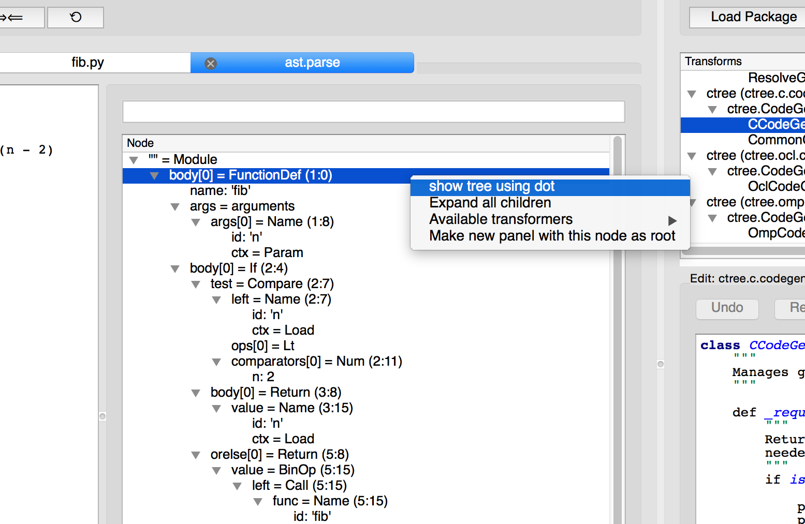

======================
Debugging Specializers
======================

Introduction
------------
Here we suggest some debugging techniques that may help you develop your
specializers. You will see brief examples of common problems you may face and
possible ways to handle them.

Logging
-------
The first thing you may want to consider, in order to have more information
about what is going on, is to activate logging. This is simply achieved by
adding the following lines to the beginning of the file:

.. code:: python

    import logging
    logging.basicConfig(level=logging.DEBUG)

Among other information, this will show you if ctree is using a cached version
of your generated code or creating a new one. If creating a new one the log
will also show the generated C code.

Let's go back to our Fibonacci Specializer. This is what will appear if we
enable logging::

    INFO:ctree.jit:detected specialized function call with arg types: [<type 'int'>]
    INFO:ctree.jit:tuner subconfig: None
    INFO:ctree.jit:arguments subconfig: {'arg_type': <class 'ctypes.c_long'>}
    INFO:ctree.jit:specialized function cache miss.
    INFO:ctree.jit:Hash miss. Running Transform
    INFO:ctree.c.nodes:file for generated C: /var/folders/wd/0gw3tcb56575wld57r1hw6y00000gn/T/tmptwc1Hu/fib/4582712020805158851/-7985492147856592190/BasicTranslator/default/generated.c
    INFO:ctree.c.nodes:generated C program: (((
    // <file: generated.c>

    long apply(long n) {
        if (n < 2) {
            return n;
        } else {
            return apply(n - 1) + apply(n - 2);
        };
    };

    )))
    INFO:ctree.c.nodes:compilation command: gcc -shared -fPIC -O2 -std=c99 -o /var/folders/wd/0gw3tcb56575wld57r1hw6y00000gn/T/tmptwc1Hu/fib/4582712020805158851/-7985492147856592190/BasicTranslator/default/generated.so /var/folders/wd/0gw3tcb56575wld57r1hw6y00000gn/T/tmptwc1Hu/fib/4582712020805158851/-7985492147856592190/BasicTranslator/default/generated.c
    55 55

This shows ctree detected the argument type as an **int** and couldn't find a
cached function to such type. After, it shows the path to the generated C file
and the actual source code in it. The last information it shows is the
compilation command used. If we continue through the log we will see the
following lines::

    INFO:ctree.jit:detected specialized function call with arg types: [<type 'float'>]
    INFO:ctree.jit:tuner subconfig: None
    INFO:ctree.jit:arguments subconfig: {'arg_type': <class 'ctypes.c_double'>}
    INFO:ctree.jit:specialized function cache miss.
    INFO:ctree.jit:Hash miss. Running Transform
    INFO:ctree.c.nodes:file for generated C: /var/folders/wd/0gw3tcb56575wld57r1hw6y00000gn/T/tmptwc1Hu/fib/4268650778531830270/-7985492147856592190/BasicTranslator/default/generated.c
    INFO:ctree.c.nodes:generated C program: (((
    // <file: generated.c>

    double apply(double n) {
        if (n < 2) {
            return n;
        } else {
            return apply(n - 1) + apply(n - 2);
        };
    };

    )))
    INFO:ctree.c.nodes:compilation command: gcc -shared -fPIC -O2 -std=c99 -o /var/folders/wd/0gw3tcb56575wld57r1hw6y00000gn/T/tmptwc1Hu/fib/4268650778531830270/-7985492147856592190/BasicTranslator/default/generated.so /var/folders/wd/0gw3tcb56575wld57r1hw6y00000gn/T/tmptwc1Hu/fib/4268650778531830270/-7985492147856592190/BasicTranslator/default/generated.c
    5.5 5.5

Those lines are pretty similar to the previous ones but now the type detected
is a **float**. Again there's no cached function for this type and ctree
generates another function, now with double as parameter and return type.

In the end you will also be able to see some statistics::

    INFO:ctree:execution statistics: (((
      specialized function call: 2
      Filesystem cache miss: 2
      specialized function cache miss: 2
      recognized that caching is disabled: 1
    )))

No problems occurred yet, we are using the log just to see how everything works
well. Let me introduce some bugs...

Cache Misuse
............
What if, in the ``args_to_subconfig`` method, we messed up and forgot to add
the argument type to the dictionary we are returning:

.. code:: python

    def args_to_subconfig(self, args):
        # return {'arg_type': type(get_ctype(args[0]))}
        return {'arg_type': type(get_ctype(0))}

This way, ``arg_type`` will always be an **int** no matter what the actual.
arguments are. The log will now look like this::

    INFO:ctree.jit:detected specialized function call with arg types: [<type 'int'>]
    INFO:ctree.jit:tuner subconfig: None
    INFO:ctree.jit:arguments subconfig: {'arg_type': <class 'ctypes.c_long'>}
    INFO:ctree.jit:specialized function cache miss.
    INFO:ctree.jit:Hash miss. Running Transform
    INFO:ctree.c.nodes:file for generated C: /var/folders/wd/0gw3tcb56575wld57r1hw6y00000gn/T/tmpd9KGMd/fib/4582712020805158851/-7985492147856592190/BasicTranslator/default/generated.c
    INFO:ctree.c.nodes:generated C program: (((
    // <file: generated.c>

    long apply(long n) {
        if (n < 2) {
            return n;
        } else {
            return apply(n - 1) + apply(n - 2);
        };
    };

    )))
    INFO:ctree.c.nodes:compilation command: gcc -shared -fPIC -O2 -std=c99 -o /var/folders/wd/0gw3tcb56575wld57r1hw6y00000gn/T/tmpd9KGMd/fib/4582712020805158851/-7985492147856592190/BasicTranslator/default/generated.so /var/folders/wd/0gw3tcb56575wld57r1hw6y00000gn/T/tmpd9KGMd/fib/4582712020805158851/-7985492147856592190/BasicTranslator/default/generated.c
    55 55

Everything goes fine when calling the function with integers since this is the
type we are always using. But when we call the function with a float::

    INFO:ctree.jit:detected specialized function call with arg types: [<type 'float'>]
    INFO:ctree.jit:tuner subconfig: None
    INFO:ctree.jit:arguments subconfig: {'arg_type': <class 'ctypes.c_long'>}
    INFO:ctree.jit:specialized function cache miss.
    INFO:ctree.jit:Hash hit. Skipping transform
    Traceback (most recent call last):
      File "fibonacci_specializer_logging.py", line 57, in <module>
        print c_fib(4.5), fib(4.5)
      File "/Library/Python/2.7/site-packages/ctree-0.1.9-py2.7.egg/ctree/jit.py", line 330, in __call__
        return csf(*args, **kwargs)
      File "fibonacci_specializer_logging.py", line 52, in __call__
        return self._c_function(*args, **kwargs)
    ctypes.ArgumentError: argument 1: <type 'exceptions.TypeError'>: wrong type

Observe we have a "``Hash hit. Skipping transform``", this happens because
``args_to_subconfig`` returns exactly the same thing as before. This way the
cached function compiled to **int** is used, causing the
``ctypes.ArgumentError`` exception we see. We are using a **float** argument to
a function that requires **int**. Inspecting the log we can easily detect the
problem.

Defective C Code (Not Compilable)
.................................
Another type of problem that the log helps to spot is when we end up with a
defective C code. A defective C code can be either a code that doesn't compile
or compiles into something that doesn't do what we want. Let's suppose we
forgot to set the return type of the function, this way ctree will set the
return to void:

.. code:: python

    def transform(self, tree, program_config):
        tree = PyBasicConversions().visit(tree)

        fib_fn = tree.find(FunctionDecl, name="apply")
        arg_type = program_config.args_subconfig['arg_type']
        # fib_fn.return_type = arg_type() # not setting the return type
        fib_fn.params[0].type = arg_type()
        c_translator = CFile("generated", [tree])

        return [c_translator]

This is how the log will look like::

    INFO:ctree.jit:detected specialized function call with arg types: [<type 'int'>]
    INFO:ctree.jit:tuner subconfig: None
    INFO:ctree.jit:arguments subconfig: {'arg_type': <class 'ctypes.c_long'>}
    INFO:ctree.jit:specialized function cache miss.
    INFO:ctree.jit:Hash miss. Running Transform
    INFO:ctree.c.nodes:file for generated C: /var/folders/wd/0gw3tcb56575wld57r1hw6y00000gn/T/tmpSmAfNJ/fib/4582712020805158851/-7985492147856592190/BasicTranslator/default/generated.c
    INFO:ctree.c.nodes:generated C program: (((
    // <file: generated.c>

    void apply(long n) {
        if (n < 2) {
            return n;
        } else {
            return apply(n - 1) + apply(n - 2);
        };
    };

    )))
    INFO:ctree.c.nodes:compilation command: gcc -shared -fPIC -O2 -std=c99 -o /var/folders/wd/0gw3tcb56575wld57r1hw6y00000gn/T/tmpSmAfNJ/fib/4582712020805158851/-7985492147856592190/BasicTranslator/default/generated.so /var/folders/wd/0gw3tcb56575wld57r1hw6y00000gn/T/tmpSmAfNJ/fib/4582712020805158851/-7985492147856592190/BasicTranslator/default/generated.c
    /var/folders/wd/0gw3tcb56575wld57r1hw6y00000gn/T/tmpSmAfNJ/fib/4582712020805158851/-7985492147856592190/BasicTranslator/default/generated.c:5:9: error: void function 'apply' should not return
          a value [-Wreturn-type]
            return n;
            ^      ~
    /var/folders/wd/0gw3tcb56575wld57r1hw6y00000gn/T/tmpSmAfNJ/fib/4582712020805158851/-7985492147856592190/BasicTranslator/default/generated.c:7:29: error: invalid operands to binary expression
          ('void' and 'void')
            return apply(n - 1) + apply(n - 2);
                   ~~~~~~~~~~~~ ^ ~~~~~~~~~~~~
    2 errors generated.
    Traceback (most recent call last):
      File "fibonacci_specializer_logging.py", line 55, in <module>
        print c_fib(10), fib(10)
      File "/Library/Python/2.7/site-packages/ctree-0.1.9-py2.7.egg/ctree/jit.py", line 324, in __call__
        csf = self.finalize(transform_result, program_config)
      File "fibonacci_specializer_logging.py", line 43, in finalize
        return BasicFunction("apply", proj, entry_type)
      File "fibonacci_specializer_logging.py", line 48, in __init__
        self._c_function = self._compile(entry_name, project_node, entry_typesig)
      File "/Library/Python/2.7/site-packages/ctree-0.1.9-py2.7.egg/ctree/jit.py", line 110, in _compile
        self._module = project_node.codegen(**kwargs)
      File "/Library/Python/2.7/site-packages/ctree-0.1.9-py2.7.egg/ctree/nodes.py", line 154, in codegen
        submodule = f._compile(f.codegen())
      File "/Library/Python/2.7/site-packages/ctree-0.1.9-py2.7.egg/ctree/c/nodes.py", line 132, in _compile
        subprocess.check_call(compile_cmd, shell=True)
      File "/System/Library/Frameworks/Python.framework/Versions/2.7/lib/python2.7/subprocess.py", line 540, in check_call
        raise CalledProcessError(retcode, cmd)
    subprocess.CalledProcessError: Command 'gcc -shared -fPIC -O2 -std=c99 -o /var/folders/wd/0gw3tcb56575wld57r1hw6y00000gn/T/tmpSmAfNJ/fib/4582712020805158851/-7985492147856592190/BasicTranslator/default/generated.so /var/folders/wd/0gw3tcb56575wld57r1hw6y00000gn/T/tmpSmAfNJ/fib/4582712020805158851/-7985492147856592190/BasicTranslator/default/generated.c ' returned non-zero exit status 1

Since we returned a value in a void function this C code doesn't compile. We
would be able to see the compiling errors even without logging enabled but, by
having it enabled, we can inspect the generated C code and understand the
problem.

Defective C Code (Compilable)
.............................
Things get a bit harder when the code compiles. Suppose that, instead of
forgetting to set the return type we forget to set the argument type. When we
don't specify the argument type, the C compiler default the argument to ``int``
and compiles without problems:

.. code:: python

    def transform(self, tree, program_config):
        tree = PyBasicConversions().visit(tree)

        fib_fn = tree.find(FunctionDecl, name="apply")
        arg_type = program_config.args_subconfig['arg_type']
        fib_fn.return_type = arg_type()
        # fib_fn.params[0].type = arg_type() # not setting the argument type
        c_translator = CFile("generated", [tree])

        return [c_translator]

And this is how the log will look::

    INFO:ctree.jit:detected specialized function call with arg types: [<type 'int'>]
    INFO:ctree.jit:tuner subconfig: None
    INFO:ctree.jit:arguments subconfig: {'arg_type': <class 'ctypes.c_long'>}
    INFO:ctree.jit:specialized function cache miss.
    INFO:ctree.jit:Hash miss. Running Transform
    INFO:ctree.c.nodes:file for generated C: /var/folders/wd/0gw3tcb56575wld57r1hw6y00000gn/T/tmpIDNG44/fib/4582712020805158851/-7985492147856592190/BasicTranslator/default/generated.c
    INFO:ctree.c.nodes:generated C program: (((
    // <file: generated.c>

    long apply(n) {
        if (n < 2) {
            return n;
        } else {
            return apply(n - 1) + apply(n - 2);
        };
    };

    )))
    INFO:ctree.c.nodes:compilation command: gcc -shared -fPIC -O2 -std=c99 -o /var/folders/wd/0gw3tcb56575wld57r1hw6y00000gn/T/tmpIDNG44/fib/4582712020805158851/-7985492147856592190/BasicTranslator/default/generated.so /var/folders/wd/0gw3tcb56575wld57r1hw6y00000gn/T/tmpIDNG44/fib/4582712020805158851/-7985492147856592190/BasicTranslator/default/generated.c
    55 55

Once again the integer argument works. Observe our function parameter doesn't
have a type but compiles without problems since C will default to ``int``.
Because it compiles to ``int``, the integer argument works. But this is the
rest of the log::

    INFO:ctree.jit:detected specialized function call with arg types: [<type 'float'>]
    INFO:ctree.jit:tuner subconfig: None
    INFO:ctree.jit:arguments subconfig: {'arg_type': <class 'ctypes.c_double'>}
    INFO:ctree.jit:specialized function cache miss.
    INFO:ctree.jit:Hash miss. Running Transform
    INFO:ctree.c.nodes:file for generated C: /var/folders/wd/0gw3tcb56575wld57r1hw6y00000gn/T/tmpIDNG44/fib/4268650778531830270/-7985492147856592190/BasicTranslator/default/generated.c
    INFO:ctree.c.nodes:generated C program: (((
    // <file: generated.c>

    double apply(n) {
        if (n < 2) {
            return n;
        } else {
            return apply(n - 1) + apply(n - 2);
        };
    };

    )))
    INFO:ctree.c.nodes:compilation command: gcc -shared -fPIC -O2 -std=c99 -o /var/folders/wd/0gw3tcb56575wld57r1hw6y00000gn/T/tmpIDNG44/fib/4268650778531830270/-7985492147856592190/BasicTranslator/default/generated.so /var/folders/wd/0gw3tcb56575wld57r1hw6y00000gn/T/tmpIDNG44/fib/4268650778531830270/-7985492147856592190/BasicTranslator/default/generated.c
    [1]    29300 segmentation fault  python fibonacci_specializer_logging.py

The code compiles successfully but the parameter type keeps defaulting to
``int`` and that drives us to an undefined behaviour when calling the function
from python. This undefined behaviour may end in a Segmentation Fault.

You may wonder why it doesn't raise an exception like on the bug from
`Cache Misuse`_. This is due to the entry type we defined in the ``finalize``
method. In the previous example, Python could identify the problem because the
entry type had an ``int`` parameter. Here our entry type says it accepts a
``float`` while the C function actually doesn't.

This kind of problem can be hard to spot even with logging enabled. We will see
other techniques that can be applied to this problem in the following sections.

Debugging Generated C Code
--------------------------

If you know how to use GDB or LLDB, they may help you a lot when debugging the
running C code. Let's go back to the previous example:

.. code:: python

    def transform(self, tree, program_config):
        tree = PyBasicConversions().visit(tree)

        fib_fn = tree.find(FunctionDecl, name="apply")
        arg_type = program_config.args_subconfig['arg_type']
        fib_fn.return_type = arg_type()
        # fib_fn.params[0].type = arg_type() # not setting the argument type
        c_translator = CFile("generated", [tree])

        return [c_translator]

As we saw on `Defective C Code (Compilable)`_ this causes an undefined
behaviour. You may be able to notice the problem by inspecting the generated
code but it may be very hard in some cases. An alternative is to use a C
debugger like  GDB or LLDB. You can simply call the python interpreter using
GDB but it will help a lot if we can compile the C code using the ``-g`` flag.
It turns ou that ctree allow us to specify the compiler flags, we just have to
add the following line before compiling the code:

.. code:: python

    ctree.CONFIG.set('c', 'CFLAGS', ctree.CONFIG.get('c', 'CFLAGS') + ' -g')

This way we are adding the ``-g`` flag to the set of compiler flags already
used by ctree.

So our BasicFunction class would look like this:

.. code:: python

    import ctree

    class BasicFunction(ConcreteSpecializedFunction):
        def __init__(self, entry_name, project_node, entry_typesig):
            ctree.CONFIG.set('c', 'CFLAGS', ctree.CONFIG.get('c', 'CFLAGS') + ' -g')
            self._c_function = self._compile(entry_name, project_node, entry_typesig)

        def __call__(self, *args, **kwargs):
            return self._c_function(*args, **kwargs)

We will use lldb here but gdb would give similar results::

    lldb python fibonacci_specializer.py

This is the output we get from lldb::

    * thread #1: tid = 0x2543e2, 0x0000000104de0f64 generated.so`apply(n=3389391) + 4 at generated.c:3, queue = 'com.apple.main-thread', stop reason = EXC_BAD_ACCESS (code=2, address=0x7fff5f3ffff8)
        frame #0: 0x0000000104de0f64 generated.so`apply(n=3389391) + 4 at generated.c:3
       1   	// <file: generated.c>
       2
    -> 3   	double apply(n) {
       4   	    if (n < 2) {
       5   	        return n;
       6   	    } else {
       7   	        return apply(n - 1) + apply(n - 2);

Here the stop reason doesn't help a lot but LLDB tells exactly the line where
the problem occurred in the C code.

Ctree Exceptions
----------------
Sometimes ctree detects a problem while generating the C code. When this
happens ctree raises an exception. We will see some common ones.

Expected a ctypes type instance, not %s, (%s)
.............................................

This usually means that you're using a type instead of an instance of this
type. This will happen if you forgot to instantiate the class to use it as the
type for an object. Consider this modification in the Fibonacci Specializer:

.. code:: python

    def transform(self, tree, program_config):
        tree = PyBasicConversions().visit(tree)

        fib_fn = tree.find(FunctionDecl, name="apply")
        arg_type = program_config.args_subconfig['arg_type']
        # fib_fn.return_type = arg_type()
        fib_fn.return_type = arg_type # <-- removing parenthesis
        fib_fn.params[0].type = arg_type()
        c_translator = CFile("generated", [tree])

        return [c_translator]

If we run the code like this we will get the following message (some lines
removed)::

    Traceback (most recent call last):
      File "fibonacci_specializer_logging.py", line 82, in <module>
        print c_fib(10), fib(10)
      File "/Library/Python/2.7/site-packages/ctree-0.1.9-py2.7.egg/ctree/jit.py", line 324, in __call__
        csf = self.finalize(transform_result, program_config)
      File "fibonacci_specializer_logging.py", line 70, in finalize
        return BasicFunction("apply", proj, entry_type)
      File "fibonacci_specializer_logging.py", line 75, in __init__
        self._c_function = self._compile(entry_name, project_node, entry_typesig)
      [...]
      File "/Library/Python/2.7/site-packages/ctree-0.1.9-py2.7.egg/ctree/c/nodes.py", line 29, in codegen
        return CCodeGen(indent).visit(self)
      File "/System/Library/Frameworks/Python.framework/Versions/2.7/lib/python2.7/ast.py", line 241, in visit
        return visitor(node)
      File "/Library/Python/2.7/site-packages/ctree-0.1.9-py2.7.egg/ctree/c/codegen.py", line 54, in visit_FunctionDecl
        s += "%s %s(%s)" % (codegen_type(node.return_type), node.name, params)
      File "/Library/Python/2.7/site-packages/ctree-0.1.9-py2.7.egg/ctree/types.py", line 115, in codegen_type
        "Expected a ctypes type instance, not %s, (%s):" % (ctype, type(ctype))

    AssertionError: Expected a ctypes type instance, not <class 'ctypes.c_long'>, (<type '_ctypes.PyCSimpleType'>)

The problem is that we are using a ``class 'ctypes.c_long'`` when we should be
using an instance of this class. Looking at the traceback we can see the bad
type is found when visiting the ``FunctionDecl``. More specifically in the
``codegen_type`` function which is called with the ``return_type``.

Sometimes we are able to identify the problem using the traceback but with more
complex specializers it may not be possible. For more complex specializers,
tools such as the `AstToolBox`_ or the `PyCharm IDE`_ will be of great use.

Expected a pure C ast, but found a non-CtreeNode: %s
....................................................
This error occurs when there is a node in the AST that wasn't converted to a
``CtreeNode``. This can happen if such node doesn't have an obvious C analogue
and so was not converted by the ``PyBasicConversions``. If that is the case you
will have to create you own transformations to convert this node to something
inherited from ``CtreeNode``. This will be seen in the next chapter.

In the other hand, it may also happen that you didn't run the
``PyBasicConversions`` on part of the code.  Let's modify the code to not call
the ``PyBasicConversions``:

.. code:: python

    def transform(self, tree, program_config):
        # tree = PyBasicConversions().visit(tree) # Not using PyBasicConversions

        # fib_fn = tree.find(FunctionDecl, name="apply") # since we didn't convert the tree, we have to use FunctionDef instead of of FunctionDecl
        fib_fn = tree.find(FunctionDef, name="apply")
        arg_type = program_config.args_subconfig['arg_type']
        fib_fn.return_type = arg_type()
        # fib_fn.params[0].type = arg_type() # FunctionDef doesn't have a params attribute, we use args.args
        fib_fn.args.args[0].type = arg_type()
        c_translator = CFile("generated", [tree])

        return [c_translator]

When we run the code like this we get the following message (some lines
removed)::

    Traceback (most recent call last):
      File "fibonacci_specializer_logging.py", line 58, in <module>
        print c_fib(10), fib(10)
      File "/Library/Python/2.7/site-packages/ctree-0.1.9-py2.7.egg/ctree/jit.py", line 324, in __call__
        csf = self.finalize(transform_result, program_config)
      File "fibonacci_specializer_logging.py", line 46, in finalize
        return BasicFunction("apply", proj, entry_type)
      File "fibonacci_specializer_logging.py", line 51, in __init__
        self._c_function = self._compile(entry_name, project_node, entry_typesig)
      File "/Library/Python/2.7/site-packages/ctree-0.1.9-py2.7.egg/ctree/jit.py", line 108, in _compile
        VerifyOnlyCtreeNodes().visit(project_node)
      [...]
      File "/System/Library/Frameworks/Python.framework/Versions/2.7/lib/python2.7/ast.py", line 249, in generic_visit
        self.visit(item)
      File "/Library/Python/2.7/site-packages/ctree-0.1.9-py2.7.egg/ctree/analyses.py", line 46, in visit
        raise AstValidationError("Expected a pure C ast, but found a non-CtreeNode: %s." % node)
    ctree.analyses.AstValidationError: Expected a pure C ast, but found a non-CtreeNode: <_ast.FunctionDef object at 0x10151ea90>.

Here we can easily spot the problem since the non-CtreeNode found is an
``ast.FunctionDef`` object, which means that our function definition was not
properly converted to C. Since ``ast.FunctionDef`` has an obvious equivalent in
C, it can be converted automatically using the ``PyBasicConversions``.

Tools
-----
As we mentioned before, some tools may be invaluable when debugging a
specializer. We will take a look at the `AstToolBox`_ and the `PyCharm IDE`_.

AstToolBox
..........
The AstToolBox allows a developer to start from a python source file and see
how a series of transformers change it. You can find the source code and
installation instructions in the `AstToolBox Repository
<https://github.com/ucb-sejits/ast_tool_box>`_.

Once you installed you can run it with::

    ast_tool_box

You can also specify a python file if you want::

    ast_tool_box fib.py

A window like this will open:

It shows the ``fib.py`` file and its AST. In the right side there is a list of
Transforms that can be applied to your code. If you click in one Transformer
the source code will appear in the box bellow. You can also load you own
Transformer.

The AST viewer can be very useful and if you can't find a particular node, you
may use the search box right above the AST:

Right click in a node in the AST for some extra options:

If you select ``show tree using dot``, a nice tree visualization will be
presented:

This tree is still not converted to C. You can apply any of the available
transformations right to a specific node. Let's apply the
``PyBasicConversions``:

Since the ``PyBasicConversions`` may have some parameters, a box will appear.
We don't need to specify any parameters here so we may just click **Go**.

Another tab will appear showing the AST after the transformation. You can
compare it with the previous AST:

.. image:: images/asttoolbox_7_PyBasicConversions_result.png
   :width: 600px

We can also generate the C code from the converted tree. We just have to call
``CCodeGen``.

.. image:: images/asttoolbox_9_CCodeGen.png
   :width: 1000px

The resulting code will be shown:

Note that, since we didn't specify the return and parameter types, the function
in the generated code has a void return and the parameter has no type
associated with it.

When creating your own transformers you can verify if a particular AST changes
the way you expect using the AstToolBox.

PyCharm IDE
...........

